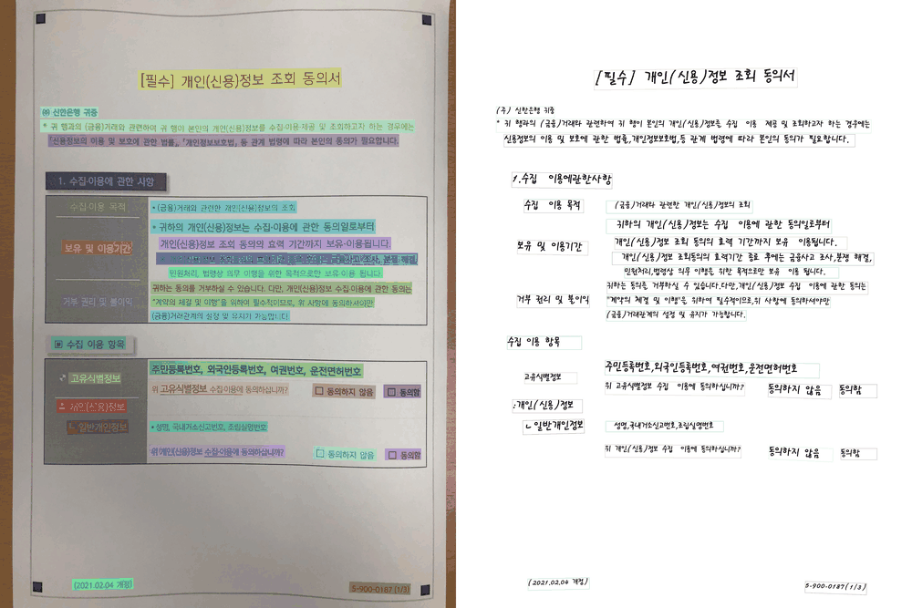

# Simple OCR-RAG

Run pretrained Korean PP-OCRv5 text detection and recognition without model
training. The project supports raw inference on a single document and diagnostic
evaluation on the AI Hub financial document OCR sample. OCR predictions can also
be indexed and queried through a small retrieval-augmented generation pipeline.




| Metric | Result |
|---|---:|
| Word detection coverage recall | 99.74% |
| Whitespace-normalized line exact match | 73.47% |
| **Whitespace-normalized CER** | **1.99%** |

Whitespace-normalized CER measures the character insertions, deletions, and
substitutions required after removing spaces from both the ground truth and OCR
output. Lower values indicate better recognition performance.

## Project structure

```text
simple-ocr/
├── src/
│   ├── ocr/
│   │   ├── infer.py       # Raw OCR inference on one image
│   │   ├── evaluate.py    # Dataset inference and evaluation
│   │   └── utils.py       # Shared OCR model and result utilities
│   └── rag/
│       ├── build_index.py # Chunk OCR text and create embeddings
│       ├── query.py       # Retrieve evidence and generate a cited answer
│       ├── service.py     # Shared retrieval and generation service
│       └── utils.py       # Chunking and similarity utilities
├── web/
│   ├── app.py             # FastAPI application
│   ├── templates/         # HTML page
│   └── static/            # CSS and browser JavaScript
├── requirements.txt
├── data/                 # Local dataset; excluded from Git
├── outputs/              # Generated results; excluded from Git
└── ocr/                  # Local virtual environment; excluded from Git
```

## Setup

Create and activate a virtual environment in PowerShell, then install the pinned
dependencies:

```powershell
python -m venv ocr
.\ocr\Scripts\Activate.ps1
python -m pip install -r .\requirements.txt
```

The first inference downloads the pretrained PaddleOCR weights. Later runs use
the cached models.

Run source files as modules from the project root (for example,
`python -m src.ocr.infer`) so package imports resolve consistently.

## Dataset

This project uses the lightweight sample of AI Hub's
[Financial Industry-Specific Document OCR Data](https://aihub.or.kr/aihubdata/data/view.do?dataSetSn=632).
Download the sample directly from AI Hub and arrange it as follows:

```text
data/
└── financial_document_OCR_dataset_sample/
    ├── annotations/
    │   ├── bank_00001.json
    │   └── ...
    └── images/
        ├── bank_00001.jpg
        └── ...
```

The downloaded images and annotations are excluded from this repository and are
not redistributed. Follow the AI Hub terms of use.

## Single-image inference

Use the OCR inference module to obtain raw predictions without comparing them with an
annotation:

```powershell
python -m src.ocr.infer `
  .\data\financial_document_OCR_dataset_sample\images\bank_00001.jpg `
  --output .\outputs\bank_00001
```

Each prediction contains recognized text, confidence, and a four-point polygon.
The command writes:

```text
outputs/bank_00001/
├── result.json
└── bank_00001_ocr_res_img.jpg
```

Useful options:

| Option | Default | Description |
|---|---:|---|
| `--threshold` | `0.5` | Minimum recognition confidence |
| `--det-limit-side-len` | `1280` | Maximum long side used by text detection |
| `--output` | `outputs` | Output directory |

Reducing `--det-limit-side-len` speeds up CPU inference but may miss small text.

## OCR-RAG prototype

The RAG prototype reuses OCR predictions stored in `outputs/evaluation_all.json`:

```text
OCR lines → source-aware chunks → embeddings → top-k retrieval
          → GPT-5 mini answer with document citations
```

The implementation uses `text-embedding-3-small` for retrieval embeddings and
`gpt-5-mini` for grounded answer generation. Set the API key only in the current
PowerShell session; never add it to source code:

An OpenAI API account with available paid credits is required. New prepaid
accounts may require a minimum initial credit purchase (commonly USD 5); check
the current billing terms and auto-recharge setting before running the example.

```powershell
$env:OPENAI_API_KEY="your-api-key"
```

Build an index from the first 10 OCR documents:

```powershell
python -m src.rag.build_index `
  --report .\outputs\evaluation_all.json `
  --limit 10 `
  --output .\outputs\rag_index.json
```

Ask a question and inspect the retrieved evidence:

```powershell
python -m src.rag.query `
  "개인신용정보 조회에 동의하지 않으면 어떤 불이익이 있나요?" `
  --show-context
```

Example questions for the 10-document prototype:

1. `개인신용정보 조회에 동의하지 않으면 어떤 불이익이 있나요?`
2. `개인신용정보를 수집하고 이용하는 목적은 무엇인가요?`
3. `조회 동의의 효력기간이 끝난 후에는 어떤 목적으로 정보를 보유하나요?`
4. `개인신용정보를 조회하는 대상 기관은 어디인가요?`
5. `문서에서 조회하거나 수집하는 개인정보 항목에는 무엇이 있나요?`

Each answer is instructed to use only the retrieved OCR evidence and cite its
source as `[document#chunk]`. If the evidence is insufficient, it should say so
rather than infer an unsupported answer.

### Web interface

After creating `outputs/rag_index.json` and setting `OPENAI_API_KEY`, start the
local FastAPI application:

```powershell
python -m uvicorn web.app:app --reload
```

Open `http://127.0.0.1:8000` in a browser. The interface provides example
questions, a Top-K selector, a generated answer, source documents, similarity
scores, and expandable OCR evidence. The API key remains in the server's
PowerShell environment and is never sent to the browser.

The sample documents may contain personal or sensitive information. Do not send
non-public documents to an external API without authorization and appropriate
de-identification. Generated indexes are stored under `outputs/` and excluded
from Git.

## Dataset evaluation

Evaluate the first image/annotation pair:

```powershell
python -m src.ocr.evaluate --limit 1
```

Evaluate a specific image:

```powershell
python -m src.ocr.evaluate --image-name bank_00095.jpg
```

Run a faster diagnostic evaluation on five images:

```powershell
python -m src.ocr.evaluate --limit 5 --det-limit-side-len 960
```

Evaluate all images in the lightweight sample:

```powershell
python -m src.ocr.evaluate
```

High-resolution, text-dense documents are slow on CPU. Start with one or a few
images before running the complete sample. The detailed report is saved to:

```text
outputs/evaluation.json
```

Evaluation options:

| Option | Default | Description |
|---|---:|---|
| `--coverage-threshold` | `0.5` | Minimum fraction of a GT word covered by a prediction |
| `--iou-threshold` | `0.5` | Legacy one-to-one polygon IoU threshold |
| `--score-threshold` | `0.5` | Minimum recognition confidence |
| `--det-limit-side-len` | `1280` | Maximum long side used by text detection |

### Evaluation method

For each image, the evaluator:

1. Applies the JPEG EXIF orientation so image pixels and annotation coordinates
   use the same orientation.
2. Reads each annotation's ID, source index, `type`, `text`, and four-point
   `points` polygon. Empty text and `type=0` ignore regions are excluded; printed
   (`type=1`) and handwritten (`type=2`) regions are retained.
3. Runs PaddleOCR and extracts predicted text, confidence, and `rec_polys`.
4. Calculates polygon IoU for every ground-truth/prediction pair.
5. Retains the original one-to-one IoU matching as a legacy diagnostic.
6. Calculates how much of each word-level ground-truth polygon is covered by each
   prediction and assigns the word to its best prediction at coverage 0.5.
7. Allows one prediction line to contain multiple ground-truth words, sorts those
   words from left to right, and builds a reference line.
8. Reports overall, printed, and handwritten word-coverage recall.
9. Compares reference and predicted lines using raw and whitespace-normalized CER
   and exact match.

Axis-aligned bounding boxes are not used. Annotation `type` is preserved in the
report, and coverage recall is reported separately for printed and handwritten
regions.

### Interpretation limitation

AI Hub annotations are generally word-level, while PaddleOCR often returns one
polygon for an entire text line. Coverage-based one-to-many assignment better
reflects this difference than one-to-one IoU. It is still a project-specific
diagnostic rather than an official or directly comparable benchmark protocol.

## Model configuration

The shared configuration in `src/ocr/utils.py` initializes PaddleOCR with
`lang="korean"` and `ocr_version="PP-OCRv5"`. PaddleOCR selects:

| Stage | Pretrained model | Purpose |
|---|---|---|
| Detection | `PP-OCRv5_server_det` | Locate text regions |
| Recognition | `korean_PP-OCRv5_mobile_rec` | Recognize Korean, English, and numeric text |

No manual model download is required. After installing the dependencies, run any
inference command:

```powershell
python -m src.ocr.infer C:\path\to\document.jpg
```

PaddleOCR downloads missing model weights automatically on the first run and
reuses the cached files afterward. On Windows, the default cache is typically:

```text
C:\Users\<username>\.paddlex\official_models\
├── PP-OCRv5_server_det\
└── korean_PP-OCRv5_mobile_rec\
```

The project uses CPU inference with oneDNN disabled for Windows compatibility.
Document orientation classification, unwarping, and text-line orientation are
also disabled.

`src/ocr/evaluate.py` explicitly applies EXIF orientation because some sample
JPEG files store landscape pixels while their annotations use the rotated
portrait coordinate system.
