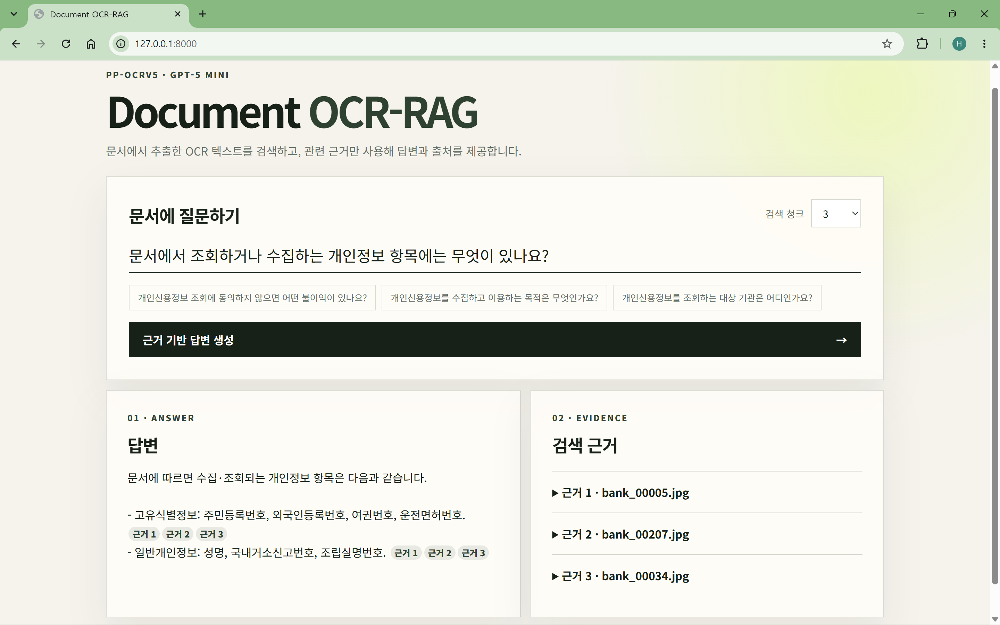

# Document OCR-RAG



Extract text from document images with **Korean PP-OCRv5**, retrieve relevant
OCR evidence with **text-embedding-3-small**, and generate grounded answers with
source citations using **GPT-5 mini**. The project provides both command-line
tools and a FastAPI web interface.

## Pipeline

```text
Document images
      ↓
PP-OCRv5 detection and recognition
      ↓
Source-aware text chunks
      ↓
text-embedding-3-small vectors and Top-K retrieval
      ↓
GPT-5 mini grounded answer with evidence
```

`PP-OCRv5` detects text regions in document images and recognizes their text.
`text-embedding-3-small` converts the extracted OCR chunks and questions into
vectors for similarity search. `gpt-5-mini` then generates the final answer
from the retrieved evidence.

## Features

- Pretrained Korean OCR inference without model training
- OCR evaluation on word-level polygon annotations
- Source-aware chunking and semantic retrieval
- Evidence-grounded answers with compact citations
- FastAPI and HTML/CSS/JavaScript web interface

## Project structure

```text
document-ocr-rag/
├── src/
│   ├── ocr/               # OCR inference, evaluation, and utilities
│   └── rag/               # Indexing, retrieval, and answer generation
├── web/                   # FastAPI application and web interface
├── assets/                # README images
├── data/                  # Local datasets; excluded from Git
├── outputs/               # Generated results and indexes; excluded from Git
├── requirements.txt
└── README.md
```

## Setup

Create and activate a virtual environment in PowerShell, then install the
dependencies:

```powershell
python -m venv ocr
.\ocr\Scripts\Activate.ps1
python -m pip install -r .\requirements.txt
```

Run Python source files as modules from the project root so package imports
resolve consistently.

## Quick start

### 1. Run OCR

```powershell
python -m src.ocr.infer C:\path\to\document.jpg --output .\outputs\document
```

### 2. Build the RAG index

An OpenAI API key with available API credits is required. See
[API setup and billing](src/rag/README.md#api-setup-and-billing) for details.
Set the key in the current PowerShell session:

```powershell
$env:OPENAI_API_KEY="your-api-key"
python -m src.rag.build_index --limit 10
```

### 3. Ask a question

```powershell
python -m src.rag.query "개인신용정보 조회에 동의하지 않으면 어떤 불이익이 있나요?"
```

Example output:

```text
Answer
귀하는 동의를 거부할 수 있습니다. 다만 조회 동의는 금융거래 계약의
체결과 이행에 필수적이므로, 동의하지 않으면 거래관계의 설정 및 유지가
불가능합니다. [bank_00030.jpg#bank_00030-chunk-000]
```

### 4. Start the web interface

```powershell
python -m uvicorn web.app:app --reload
```

Open `http://127.0.0.1:8000` in a browser.

## Detailed guides

- [OCR inference and evaluation](src/ocr/README.md)
- [RAG indexing, querying, and web interface](src/rag/README.md)

## Data and security

The sample dataset is not redistributed. Download it from AI Hub's
[Financial Industry-Specific Document OCR Data](https://aihub.or.kr/aihubdata/data/view.do?dataSetSn=632)
page and comply with its terms of use. Documents can contain personal or sensitive information;
do not send non-public data to an external API without authorization and
appropriate de-identification. Local datasets, generated OCR results, and RAG
indexes are excluded from Git.
